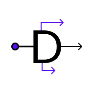
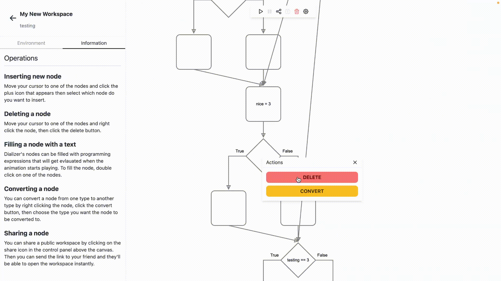

<!-- PROJECT LOGO -->
 

  
  <h1 align="center">Dializer</h1>

  

    A web-based flowchart interpreter.
  

  
  

  
  [![Stargazers][stars-shield]][stars-url]
  [![Issues][issues-shield]][issues-url]
  [![MIT License][license-shield]][license-url]

  

  

<!-- ABOUT THE PROJECT -->

## About The Project

Dializer is a web-based application I created for my thesis.
It's intended to be a more-accessible alternative to [RAPTOR](https://raptor.martincarlisle.com).
It faciliates flowchart creation as well as interpretation of the flowchart (running the flowchart).
To do this, it utilizes [Konva](https://konvajs.org/) for flowchart rendering as well as features a
custom _Recursive Descent Interpreter_ for evaluating the unnamed DSL that is used by it.

<!-- ROADMAP -->

## Features

- Interpret the flowchart, not only visualize it.
- 7 flowchart node types: start, process, input, output, loop, branch, and end.
- A DSL to express programming operations.
- Cloud save, never lose your changes when switching device.
- Easy workspace sharing.

More features are planned, see the [issues](https://github.com/danilhendrasr/dializer) page.

### Built With

[![React][react-shield]][react-url]
[![Nest.js][nest-shield]][nest-url]
[![PostgreSQL][postgre-shield]][postgre-url]

(<a href="#top">back to top</a>)

<!-- GETTING STARTED -->

## Getting Started

### Prerequisites

- Node v18+
- Docker (recommended)

### Local Deployment

1. Clone the repo and `cd` into the directory.
2. Run `npm install`.
3. Copy the `.env.example` file of the `apps/backend` directory and rename it to `.env` and fill the keys.
4. Run `docker compose up -d`.
5. Dializer frontend is accessible via http://localhost:4200
6. Dializer API is accessible via http://localhost:3333/api

(<a href="#top">back to top</a>)

<!-- LICENSE -->

## License

Distributed under the MIT License. See [LICENSE][license-url] for more information.

(<a href="#top">back to top</a>)

<!-- CONTACT -->

## Contact

[![Twitter][twitter-shield]][twitter-url]
[![LinkedIn][linkedin-shield]][linkedin-url]
[![Email][gmail-shield]][mail-url]

(<a href="#top">back to top</a>)

<!-- MARKDOWN LINKS & IMAGES -->
<!-- https://www.markdownguide.org/basic-syntax/#reference-style-links -->

[repo-url]: (https://github.com/danilhendrasr/dializer)
[stars-shield]: https://img.shields.io/github/stars/danilhendrasr/dializer.svg?style=for-the-badge
[stars-url]: https://github.com/danilhendrasr/dializer/stargazers
[issues-shield]: https://img.shields.io/github/issues/danilhendrasr/dializer.svg?style=for-the-badge
[issues-url]: https://github.com/danilhendrasr/dializer/issues
[license-shield]: https://img.shields.io/github/license/danilhendrasr/dializer.svg?style=for-the-badge
[license-url]: https://github.com/danilhendrasr/dializer/blob/main/LICENSE
[twitter-shield]: https://img.shields.io/badge/Twitter-1DA1F2.svg?style=for-the-badge&logo=twitter&logoColor=white
[twitter-url]: https://twitter.com/danilhendrasr
[linkedin-shield]: https://img.shields.io/badge/LinkedIn-0A66C2.svg?style=for-the-badge&logo=linkedin&logoColor=white
[linkedin-url]: https://linkedin.com/in/danilhendrasr
[gmail-shield]: https://img.shields.io/badge/Email-EA4335.svg?style=for-the-badge&logo=gmail&logoColor=white
[mail-url]: mailto:danilhendrasr@gmail.com
[react-shield]: https://img.shields.io/badge/React-61DAFB?style=for-the-badge&logo=react&logoColor=000
[react-url]: https://reactjs.org/
[nest-shield]: https://img.shields.io/badge/Nest.js-E0234E?style=for-the-badge&logo=nestjs&logoColor=white
[nest-url]: https://reactjs.org/
[postgre-shield]: https://img.shields.io/badge/PostgreSQL-4169e1?style=for-the-badge&logo=postgresql&logoColor=white
[postgre-url]: https://postgresql.org/
